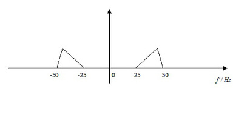
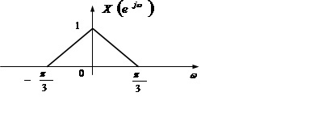
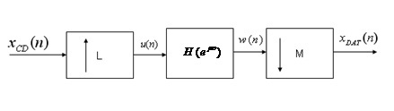
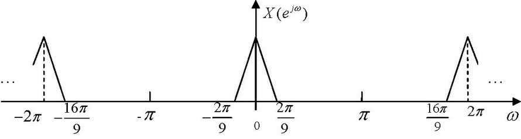
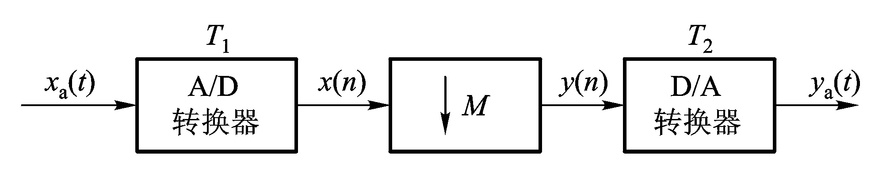

<h1 align="center">DSP-review</h1>

# $\Re$ 目录

[TOC]

# $\wp$ 填空(10)

### 1. $y(n)=x(n-k),k>0$,表示$y(n)$是整个$x(n)$在整个$x(n)$在时间轴

###      上==右==移$k$个采样周期所得到的新序列?

### 2. 在数字信号处理中,可以将信号存储起来,用==延迟==的方法实现非因

###      果系统,从而提高了系统的性能指标.

# $\Re$ 选择(40)

### 1.下面有关数字信号的概念,哪个说法是正确的?

- A.数字信号是时间变量是连续值，幅度值是离散值。
- `B.数字信号是时间变量是离散值，幅度值也是离散值。`
- C.数字信号是时间变量是离散值，幅度值是连续值。
- D.数字信号是时间变量是连续值，幅度值也是连续值。

### 2.1024点的DFT需要多少次的复数乘法运算?

- A.十万次
- B.千万次
- C.一万次
- `D.百万次`

### 3.哪一年,宾夕法尼亚大学发明了第一代电子管计算机?

- `A.1946年`
- B.1980年
- C.1956年
- D.1936年

### 4.CD唱盘是哪一年问世的?

- A.1990年
- B.1960年
- C.1978年
- `D.1982年`

### 5.由多个信号源产生的信号称为什么信号?

- A.离散信号
- `B.向量信号`
- C.标量信号
- D.连续信号

### 6. 请确定以下序列的周期长度:$x(n)=\sin(\cfrac{\pi n}{4})-\cos(\cfrac{\pi n}{7})$

- A.4
- `B.56`
- C.28
- D.7

### 7.系统$y(n)=x^2(n)$,$y(n)$表示输出,$x(n)$表示输入,

### 试确定系统是否是线性系统?是否是时不变系统?

- A.非线性时变系统
- `B.非线性时不变系统`
- C.线性时不变系统
- D.线性时变系统

### 8.系统$y(n)=\sum\limits_{m=-{\infty}}^{n}x(m)$,其中$y(n)$表示输出,$x(n)$表示输入,

### 试确定系统是否是线性系统?是否是时不变系统？

- `A.线性时不变系统`
- B.线性时变系统
- C.非线性时变系统
- D.非线性时不变系统

### 9. 系统$y(n)=x(n-n_0)$,其中$n_0<0$,$y(n)$表示输出,$x(n)$表示输入

### 试确定系统的因果性和稳定性

- A.非因果不稳定系统
- B.因果不稳定系统
- C.因果稳定系统
- `D.非因果稳定系统`

### 10.系统$y(n)=g(n)x(n)$,其中$g(n)$有界,$y(n)$表示输出,$x(n)$表示输入

### 试确定系统的因果性和稳定性

- `A.因果稳定系统`
- B.非因果稳定系统
- C.因果不稳定系统
- D.非因果不稳定系统

### 11.令$X(e^{j\omega})$表示实因果序列$x(n)$的DTFT,求$x^*(n)$的DTFT:

- A.$X(e^{-j\omega})$
- `B.`$\large X^*(e^{-j\omega})$  
- C.$X^*(e^{j\omega})$
- D.$X(e^{j\omega})$

### 12.令$X(e^{j\omega})$表示实因果序列$x(n)$的DTFT,求$x(2n)$的DTFT:

- A. $0.5*[X(e^{j\omega/2})-X(-e^{-j\omega/2})]$
- `B.` $\large 0.5*[X(e^{j\omega/2})+X(-e^{j\omega/2})]$
- C. $0.5*[X(e^{j\omega/2})+X(-e^{-j\omega/2})]$
- D. $0.5*[X(e^{j\omega/2})-X(-e^{j\omega/2})]$

### 13.求序列$\delta(n-1)$的Z变换的收敛域:

- A. $0\le|z|\le\infty$
- B. $0\le|z|<\infty$
- `C.` $\large 0<|z|\le\infty$
- D. $0<|z|<\infty$

### 14.求以下序列的Z变换的收敛域:$a^{|n|},|a|<1$

- `A.`$\large |a|<|z|<\cfrac{1}{|a|}$
- B.$|a|<|z|<\infty$
- C.$0<|z|<\cfrac{1}{|a|}$
- D.$\cfrac{1}{|a|}<|z|<\infty$

### 15.一个线性时不变系统具有频率响应$H(e^{j\omega})=\cfrac{e^{j\omega}}{1.1+\cos\omega}$

### 求系统的差分方程.

- `A.`$\large y(n)+2.2y(n-1)+y(n-2)=2x(n)$
- B.$y(n)+y(n-1)+y(n-2)=x(n)$
- C.$y(n)+1.1y(n-1)+y(n-2)=2x(n)$
- D.$y(n)+2.2y(n-1)+y(n-2)=x(n)$

### 16. 给定一连续带限信号$x_a(t)$,其频谱当$|f|>B$时,$X_a(t)=0$

### 求$x_a^2(t)$的最低采样频率

- A.B
- B.2B
- `C.4B`
- D.8B

### 17. 给定一连续带限信号$x_a(t)$,其频谱当$|f|>B$时,$X_a(t)=0$

### 求$x_a(2t)$的最低采样频率

- A.B
- B.2B
- `C.4B`
- D.8B

### 18. 给定一连续带限信号$x_a(t)$,其频谱当$|f|>B$时,$X_a(t)=0$

### 求$x_a(t)\cos(7\pi Bt)$的最低采样频率

- A.B
- B.2B
- `C.9B`
- `D.4.5B (欠采样)` 

### 19. 一带通模拟信号如图所示，现用以下采样频率对其采样.

### $(1)10Hz\quad(2)25Hz\quad(3)50Hz\quad(4)100Hz$,

### 求采样后哪几种采样频率存在混叠？

- `A.(1)`
- `B.(2)`
- C.(3)
- D.(4)

### 20. 已知信号x(t)为带限信号,最高截止频率300Hz,

### 当采样频率为500Hz时,采样信号频谱不会产生混叠

- A. $\surd$

- `B.` $\Large \times $

### 21. 对$x(n) (0\le n\le7)$和$y(n) (0\le n\le19)$分别作20点的DFT,

### 得$X(k)$和$ $Y(k)$,$F(k)=X(k)Y(k) (0\le n\le19)$,$f(n)=IDFT[F(k)]$,

### n在___ 范围内时,$f(n) $是$x(n)$和$y(n)$的线性卷积

- A. $0\le n\le7$
- `B.` $7\le n\le19$
- C. $12\le n\le19$
- D. $0\le n\le19$

### 22. $x_1(n)=R_10(n),x_2(n)=R_7(n)$,用DFT计算二者的线性卷积,

### 为使计算量尽可能地少,应使DFT的长度N满足

- A. $N>16$
- `B.` $N=16$
- C. $N<16$
- D. $N\not=16$

### 23. 一个采样频率为$f_s$的$N$点序列$x(n)$,其$N$点DFT结果$X(2)$代表的频谱

- A. $ f_s/N$
- `B.`$ 2f_s/N$ 
- C. $4f_s/N$
- D. $ f_s/2N$

### 24. 计算两个N点序列的线性卷积,至少要做多少点得到DFT？

- A. N
- `B. 2N-1`
- C. 2N
- D. 2N+1

### 25. 对于高斯序列$x(n)=exp[-(n-p)^2/q]$,取16点作FFT,其幅度谱中

### 低频分量最多的是

- A. p=8,q=2
- `B. p=8,q=8`
- C. p=14,q=8
- D. p=2,q=8

### 26. 一般说来按时间抽取基二FFT的___序列是按位反转重新排列的

- `A.输入`
- B.输出
- C.输入和输出
- D.输入和输出都不是

### 27. $x(n)=\{1,0,0,0\},\cfrac{1}{4}\sum\limits_{k=0}^{3}|X(k)|^2=?$

- `A. 1`
- B. 2
- C. 3
- D. 4

### 28. $Chirp-z$变换的频率采样点不必在单位圆上

- `A.` $\large \surd$
- B. $\large \times$

### 29. 采样频率$f_s=5000Hz$,DFT长度为2000,其谱线间隔为$2.5Hz$

- `A.` $\large \surd$
- B. $\large \times$

### 30. 一个长度为$N$的有限长序列可用$N$个频域的采样值唯一地确定

- `A.` $\large \surd$
- B. $\large \times$

### 31. 下面说法哪个是错误的？

- A. 绝对可和序列的DTFT必定存在。
- B. 绝对可和序列的能量一定有限。
- `C. 一个序列的DTFT存在，则该序列一定是绝对可和序列。`
- D. 一个序列的DTFT存在，表示该序列DTFT对应级数一定收敛。

### 32. 求序列$\delta(n-1)$的Z变换的收敛域:

- `A.` $0\le|z|\le\infty$
- B. $0\le|z|<\infty$
- C. $\large 0<|z|\le\infty$
- D. $0<|z|<\infty$

### 33. 逆Z变换的围线积分定义式中,积分路径C是一条收敛环域内顺时针

### 方向绕原点一周的单围线

- A. $ \surd$
- `B.` $\large \times$

### 34. 系统$y(n)=x(Dn)$是时不变系统,其中$D$是正整数

- A. $ \surd$
- `B.` $\large \times$

### 35. 一个LTI系统$H(z)$是因果稳定的,其收敛域为$R_{x-}<|z|\le \infty$,则

- A. $R_{x-}\le 1$
- `B.` $R_{x-}< 1$
- C. $ R_{x-}> 1$
- D. $ R_{x-}\ge 1$

### 36. 对于因果系统函数$H(z)=\cfrac{z}{z-a},0<a<1$,试根据系统函数$H (z)$的

### 零极点分布确定系统的频率特性是

- A. 高通滤波器
- `B. 低通滤波器`
- C. 带通滤波器
- D. 带阻滤波器

### 37. 一个周期为N的周期序列$\tilde{x}(n)$的离散傅立叶级数在频域上仍然是

### 一个周期序列,其周期是

- A. N-1
- `B. N`
- C. 2N-1
- D. 2N

### 38. 留声机诞生于哪一年？

- A. 1988
- `B. 1877`
- C. 1977
- D. 1920

### 39. 哪一年J. W. Cooley和J. W. Tukey提出了快速傅里叶变换算法？

- A. 1942
- B. 1952
- `C. 1965`
- D. 1975

---

# $\mho$ 简答(30)

### 1. 信号(signal):

>  `是信息的物理体现形式,或是传递信息的函数,而信息则是信号的具体内容`

### 2. 模拟信号(analog signal):

> `指时间连续、幅度连续的信号`

### 3.数字信号(digital signal):

> `时间和幅度上都是离散(量化)的信号`

- 数字信号可用一序列的数表示,而每个数又可表示为二制码的形式,适合计算机处理
- - `一维(1-D)信号: 一个自变量的函数`

- - `二维(2-D)信号: 两个自变量的函数`

- - `多维(M-D)信号: 多个自变量的函数`

### 4. 系统:

> `处理信号的物理设备。或者说，凡是能将信号加以变换以达到人们要求的各种设备`

### 5. 信号处理的内容:

> `滤波、变换、检测、谱分析、估计、压缩、识别等一系列的加工处理`

### 6. 模拟信号处理缺点:

> `难以做到高精度，受环境影响较大，可靠性差，且不灵活等`

### 7. 数字系统的优点:

> `体积小、功耗低、精度高、可靠性高、灵活性大、易于大规模集成、可进行二维与多维处理`

### 8. 数字信号处理的应用表现在哪几个方面？

> `自动控制`
>
> `消费电子`
>
> `电子通信`
>
> `语音`
>
> `图形/图像`
>
> `工业应用`
>
> `仪器`
>
> `医疗器件`
>
> `军事器件`

### 9. 数字信号处理与传统的模拟信号处理相比较,除了数字系统共同

### 优点,如抗干扰,可靠性强,便于大规模集成外,还具有哪些明显的优点？

> - 优点
>
> - - 精度高
>   - 灵活性强
>   - 可以实现模拟信号很难达到的指标式特性
>
>   - 可以实现多维信号存储
>
> - 缺点
>
> - - 增加了系统的复杂性
>
>   - 应用的频率范围受到限制
>   - 系统的功率消耗比较大

---

# $\aleph$ 计算(20)

### 1.试求下列序列的DTFT:

#### (1) $x(n)=\cfrac{1}{2}\delta(n+1)+\delta(n)+\cfrac{1}{2}\delta(n-1)$

#### (2) $x(n)=(\cfrac{1}{2})^nu(n+1)$

> $$
> \begin{align*} \large (1)解: 由 DTFT定义得: \\X(e^{j\omega}) & =\sum\limits_{n=-\infty}^\infty x(n)e^{-j\omega n} \\ & = \sum\limits_{n=-\infty}^\infty [\cfrac{1}{2}\delta(n+1)+\delta(n)+\cfrac{1}{2}\delta(n-1)]e^{-j\omega n} \\ & = \sum\limits_{n=-1}^{-1}\cfrac{1}{2}\delta(n+1)e^{-j\omega n}+\sum\limits_{n=0}^{0}\delta(n)e^{-j\omega n}+\sum\limits_{n=1}^{1}\cfrac{1}{2}\delta(n-1)e^{-j\omega n} \\& = \cfrac{1}{2}e^{j\omega n}+1+\cfrac{1}{2}e^{-j\omega n} \\
> & = 1+\cfrac{1}{2}(e^{j\omega n}+e^{-j\omega n}) \\
> & = 1+\cos\omega 
> \end{align*}
> $$
>
>

> $$
> \begin{align*} \large  (2)解: \quad 由 DTFT定义得: \\ X(e^{j\omega}) & =\sum\limits_{n=-\infty}^\infty x(n)e^{-j\omega n} \\ & = \sum\limits_{n=-1}^{\infty}(\cfrac{1}{2})^ne^{-j\omega n} \\ & = \sum\limits_{n=-1}^{\infty}(\cfrac{1}{2}\cdot e^{-j\omega)^n} \\
> & = \cfrac{2e^{j\omega}}{1-\cfrac{1}{2}e^{-j\omega}} 
> \end{align*}
> $$
>
>

### 2. 请问正弦序列$\sin(\cfrac{16}{5}\pi n)$是否是周期序列?

### 若是,其周期长度是多少?

> 解： $\large N=\cfrac{2\pi k}{\omega}=\cfrac{2\pi}{16\pi /5}\times8=5$
>
> `是周期序列，最小周期长度为5`

### 3. 试确定以下系统是否为线性系统？是否为时不变系统？

#### (1) $y(n)=x(n-n_0)$

#### (2) $y(n)=nx(n)$

#### (3) $y(n)=6x(n)+3$

#### (4) $y(n)=x^3(n)$

#### (5) $y(n)=\sum\limits_{m=-\infty}^nx(m)$

| 解: | 线性系统 | 时不变系统 |
| ------------------------------------------- | ---------- | ---------- |
| $\large y(n)=x(n-n_0)$                      | 线性系统   | 时不变系统 |
| $\large y(n)=nx(n)$                         | 线性系统   | 时变系统   |
| $\large y(n)=6x(n)+3$                       | 非线性系统 | 时不变系统 |
| $\large y(n)=x^3(n)$                        | 非线性系统 | 时不变系统 |
| $\large y(n)=\sum\limits_{m=-\infty}^nx(m)$ | 线性系统   | 时不变系统 |

### 4.试确定以下系统的因果性和稳定性：

#### (1) $y(n)=\sum\limits_{k=n_0}^nx(k),n>n_0$

#### (2) $h(n)=\cfrac{1}{n!}u(n)$

#### (3) $h(n)=2^nR_N(n)$

#### (4) $h(n)=2^nu(n)$

#### (5) $h(n)=5^nu(-n)$

| 解: | 因果性 | 稳定性 |
| --------------------------------------------- | ------ | ------ |
| $\large y(n)=\sum\limits_{k=n_0}^nx(k),n>n_0$ | 因果   | 不稳定 |
| $\large h(n)=\cfrac{1}{n!}u(n)$               | 因果   | 稳定   |
| $\large h(n)=2^nR_N(n)$                       | 因果   | 稳定   |
| $\large h(n)=2^nu(n)$                         | 因果   | 不稳定 |
| $\large h(n)=5^nu(-n)$                        | 非因果 | 不稳定 |

### 5. 求以下序列的*Z*变换及收敛域:

#### (1) $\delta(n-n_0)$

#### (2) $0.5^n[u(n)-u(n-10)]$

| 解:                                                          |
| ------------------------------------------------------------ |
| $\begin{align*} \LARGE (1): \quad 由Z变换公式得：\\  X(z) & =\sum\limits_{n=-\infty}^{\infty}\delta(n-n_0)z^{-n} \\ & = \sum\limits_{n=n_0}^{n_0}\delta(n-n_0)z^{-n} \\ & =z^{-n_0} \end{align*} $ |
| 若$n_0<0$时，收敛域为：$0\le|z|<\infty$                      |
| 若$n_0>0$时，收敛域为：$0<|z|\le\infty$                      |
| 若$n_0=0$时，收敛域为：$0\le|z|\le \infty$                   |

| 解:                                                          |
| ------------------------------------------------------------ |
| $\begin{align*} \LARGE (2): \quad  由Z变换公式得：\\  X(z) & =\sum\limits_{n=-\infty}^{\infty}0.5^n(u(n)-u(n-10))z^{-n} \\ & = \sum\limits_{n=0}^{9}0.5^nz^{-n} \\ & =\sum\limits_{n=0}^{9}(0.5\cdot z^{-1})^n \\ & =\cfrac{1-(0.5\cdot z^{-1})^{10}}{1-0.5\cdot z^{-1}} \end{align*} $ |
| 收敛域为：$0<|z|$                                            |

### 6. 设序列$x(n)$和$y(n)$的Z变换分别为$X(z)$和$Y(z)$,

### 试求$X(z)$和$Y(z)$的关系:

$\large\left\{
\begin{aligned}
y(2n)=x(n) \\
y(2n+1)=0 \\
\end{aligned}
\right.​$

| 解：                                                         |
| ------------------------------------------------------------ |
| $ \begin{align*} \large Y(z) & = \sum\limits_{n={-\infty}}^{\infty}y(n)z^{-n} \\ & = \sum\limits_{m={-\infty}}^{\infty}y(2m)z^{-2m}+\sum\limits_{m={-\infty}}^{\infty}y(2m+1)z^{-(2m+1)} \\ & = \sum\limits_{m={-\infty}}^{\infty}X(m)z^{-2m}+0 \\ & = X(z^2) \end{align*}$ |

### 7. 设序列$x(n)$和$y(n)$的Z变换分别为$X(z)$和$Y(z)$,

### 试求$X(z)$和$Y(z)$的关系:

$\large y(2n)=y(2n+1)=x(n)$

| 解：                                                         |
| ------------------------------------------------------------ |
| $ \begin{align*} \large Y(z) & = \sum\limits_{n={-\infty}}^{\infty}y(n)z^{-n} \\ & = \sum\limits_{m={-\infty}}^{\infty}y(2m)z^{-2m}+\sum\limits_{m={-\infty}}^{\infty}y(2m+1)z^{-(2m+1)} \\ & = \sum\limits_{m={-\infty}}^{\infty}X(m)z^{-2m}+\sum\limits_{m={-\infty}}^{\infty}X(m)z^{-(2m+1)} \\ & = X(z^2)+2^{-1}\cdot X(z^2) \\ & = (1+z^{-1})X(z^2) \end{align*}$ |

### 8. 已知系统的差分方程$y(n)-0.25y(n-1)=0.5x(n)+0.45x(n-1)+0.35x(n-2)$,

### 且在$n<0$时$y(n)=0$.求该系统的系统函数。

| 解：                                                         |
| ------------------------------------------------------------ |
| `将等式两边进行Z变换得：`                                    |
| $\large Y(z)(1-\cfrac{1}{4}\cdot z^{-1})=X(z)(\cfrac{1}{2}+\cfrac{9}{20}\cdot z^{-1}+\cfrac{7}{20}\cdot z^{-2}) $ |
| $\large H(z)=\cfrac{Y(z)}{X(z)}=\cfrac{\cfrac{1}{2}+\cfrac{9}{20}\cdot z^{-1}+\cfrac{7}{20}\cdot z^{-2}}{1-\cfrac{1}{4}\cdot z^{-1}}=\cfrac{10z^2+9z+7}{20z^2-5z}$ |

### 9. $x(n)$的DTFT为$X(e^{j\omega})$,试求$x(-n)​$的DTFT。

| 解：                                                         |
| ------------------------------------------------------------ |
| 令$y(n)=x(-n)$:                                              |
| $\begin{align*}\large Y(e^{j\omega}) & = \sum\limits_{n={-\infty}}^{\infty}y(n)e^{-j\omega n} \\ & =\sum\limits_{n={-\infty}}^{\infty}x(-n)e^{-j\omega n}  \end{align*} $ |
| 令$-n=t$,则$n=-t$                                            |
| $ \begin{align*}\large Y(e^{j\omega}) & = \sum\limits_{t={-\infty}}^{\infty}x(t)e^{-j\omega t} \\ & =X(e^{-j\omega}) \end{align*}  $ |

### 10. 讨论一个具有下列系统函数的线性时不变因果系统:

### $H(z)=\cfrac{1-a^{-1}z^{-1}}{1-az^{-1}}$

### 其中*a*为实数。

#### (1) 对于什么样的*a*值范围系统是稳定的？

#### (2) 证明该系统是一个全通系统，即频率响应的幅度为一常数。

| 解：                                                         |
| ------------------------------------------------------------ |
| (1): 极点$ \large z=a,\therefore |a|\le 1$ 又$ \large \because a\not=0, \therefore 0<|a|\le 1$ |
| (2): 作图知极点$a$在单位圆的实轴上,零点$1/a$在单位圆外的实轴上,由余弦定理得: |
| 极点矢量长度$ \large =\sqrt{a^2+1-2a\cos(\omega)}$           |
| 零点矢量长度$ \large =\sqrt{a^{-2}+1-2a^{-1}\cos(\omega)}=\cfrac{1}{|a|}\sqrt{a^2+1-2a\cos(\omega)}$ |
| 系统频率响应即为极点矢量长度与零点矢量长度之比,$\large |H(e^{j\omega})|=|\cfrac{1-a^{-1}e^{-j\omega}}{1-ae^{-j\omega} }|=\cfrac{1}{|a|}$ |
| $\large \cfrac{1}{|a|}$是常数,所以是全通系统,得证            |

### 11. 离散时间信号$x(n)$频谱如图所示,试求$M=3$直接抽取(不滤波)后

### 的信号的频谱。

### 12. 数字录音带(DAT)驱动器的采样频率为48kHz,而激光唱盘(CD)播放机

### 则以44.1kHz的采样频率工作。为了直接把声音从CD录制到DAT,需要把

### 采样频率从44.1kHz转换到48kHz。为此,考虑完成图所示的采样率转换

### 系统。求L和M的最小可能值以及适当的滤波器$H(e^{j\omega})$完成这个转换。

| 解：                                                         |
| ------------------------------------------------------------ |
| 已知$\large 48000=2^7\cdot3 \cdot 5^3$及$\large 44100=2^2\cdot 3^2\cdot 5^2\cdot 7^2$,为改变采样频率,需 |
| $\large \cfrac{L}{M}=\cfrac{2^7\cdot3 \cdot 5^3}{2^2\cdot 3^2\cdot 5^2\cdot 7^2}=\cfrac{2^5\cdot 5}{3\cdot 7^2}= \cfrac{160}{147}$ |
| 选择内插因子$\large L=160$而抽取因子$\large M=147$,便可转换采样率 |
| 低通滤波器的边界频率为$ \large \omega_c=min(\cfrac{\pi}{L},\cfrac{\pi}{M})=\cfrac{\pi}{160} $ |
| 其增益应等于$\large L=160$,采样频率为$\large (44.1\times 160)KHz=7056KHz$ |

### 13. 序列$x(n)$的傅里叶变换如图所示,希望最大可能地对$x(n)$降低采样率,

### 而不引入混叠。

| 解：                               |
| ---------------------------------- |
| $\large \cfrac{L}{M}=\cfrac{2}{9}$ |

### 14. 考虑图所示的系统，假设$x_a(t)$输入是带限的,

###        即对于$|\Omega|>4000\pi rad/s,X_a(j\Omega)\equiv0$。

#### (1) 为使$y_a(t)$等于$x_a(t)$,应该对$M,T_1,T_2$有何约束?

#### (2) 如果$f_1=1/T_1=30kHz,M$最大可以取多少?

| 解：                                |
| ----------------------------------- |
| (1): $\large T_2<0.25ms,T_1=T_2/M $ |
| (2): $\large M$最大取`7`            |

### 15. 若已知$DFT[x(n)]=X(k)$,求$DFT[x(n)\cos(\cfrac{2\pi}{N}mn)], 0<m<N$

> $$
> \large
> DFT[x(n)\cos(\cfrac{2\pi}{N}mn)]=\cfrac{1}{2}[X((k-m))_N+X((k+m))_N]
> $$
>
>

### 16. 已知$x(n)=\{1,2,2,1\}$,求用定义计算$x(n)$的DFT并验证$Parseval$定理。

>$$
>\large
>\begin{align}
>X(k) = \{①+②+③+④,& ①-③+(④-②)j,(①-②)+(③-④),①-③+(②-④)j\} \\
>X(k) = &\{6,-1-j,0,-1+j\} \\
>已知:\sum\limits_{n=0}^{N-1}|x(n)|^2 & =\cfrac{1}{N}\sum\limits_{n=0}^{N-1}|X(k)|^2\\
>时域:\sum\limits_{n=0}^{3}|x(n)|^2 & =1^2+2^2+2^2+1^2=10 \\
>频域:\cfrac{1}{4}\sum\limits_{n=0}^{3}|X(k)|^2 & =\cfrac{1}{4}[6^2+1^2+1^2+0+1^2+1^2]=10 \\
>时域频域相等,满足定理
>\end{align}
>$$
>
>

### 17. 已知$x(n)$是长为$N$的有限长序列,$X(k)=DFT[x(n)]$,现将$x(n)$的

### 每二点之间补进$r-1$个零值,得到一个长为$rN$的有限长序列$y(n)$,

$\large y(n)=\left\{
\begin{array}{rcl}
x(n/r),       &   n=ir,   & i=0,1,\cdots,N-1\\
0     &      & 其他\\
\end{array} \right.$

### 求$DFT[y(n)]$与$X(k)$的关系。

> $$
> \large
> DFT[y(n)]=Y(k)=X((k)_NR_{rN}(k),\qquad k=0,1,2,\cdots,N-1)
> $$
>
>

### 18. 已知$x(n)=\{3,5,-1,6,1,0,2,-2\},DFT[x(n)]=X(k)$,并且$Y(k)=W_N^{3k}X(k)$.求:

#### (1) $y(n)=IDFT[Y(k)]$

#### (2) $\sum\limits_{k=0}^{N-1}|Y(k)|^2$

### 19.  已知复序列$f(n)$是由两个实有限长序列$x(n,)y(n)$组成,

### $f(n)=x(n)+jy(n)$,并且$DFT[f(n)]=F(k)$,

### $F(k)=\cfrac{1-a^N}{1-aW_N^k}+j\cfrac{1-b^N}{1-bW_N^k}$,

### 求$X(k),Y(k)$以及$x(n),y(n)$。

| 解：                                                         |
| ------------------------------------------------------------ |
| $\large X(k)=\cfrac{1-a^N}{1-aW_N^k}=\sum\limits_{n=0}^{N-1}a^nW_n^{kn} $ |
| $\large Y(k)=\cfrac{1-b^N}{1-bW_N^k}=\sum\limits_{n=0}^{N-1}a^nW_n^{kn} $ |
| $ \large x(n)=a^nR_N(n)$                                     |
| $ \large y(n)=b^nR_N(n) $                                    |

### 20. $N$点序列$x(n)$的DFT为$X(k)$,并有

#### (1) $x_1(n)=(-1)^nx(n)$

#### (2) $x_2(n)=x(N-1-n)$

### 分别求$x_1(n)$的DFT$X_1(k)$以及$x_2(n)$的DFT$X_2(k)$与$X(k)$的关系。

| 解：                              |
| --------------------------------- |
| (1): $\large X_1(k)X(k+N/2)$      |
| (2): $\large X_2(k)W_N^{-k}X(-k)$ |

### 21. 希望利用一个长度为50的有限长单位脉冲响应滤波器来过滤一段

### 很长的数据,要求利用重叠保留法并通过FFT来实现这种滤波器。为做

### 到这一点,首先输入各段必须重叠N个样本;其次必须从每一段产生的输

### 出中取出M个样本,并把它们拼接在一起形成一长序列,即为滤波输出。

### 设输入的各段长度为100个样本,而FFT的长度为128,循环卷积的输出序

### 号为0~127.

#### (1) 求N；

#### (2) 求M；

#### (3) 求取出的M个点的起点与终点序号,即循环卷积的128点中取出哪些点去和前一

####        段的点衔接起来？

| 解：                     |
| ------------------------ |
| (1): $\large N=49$       |
| (2): $\large M=51$       |
| (3): $\large 49 \sim 99$ |

### 22. 一个实时卷积器是用FFT的重叠保留法分段处理的,假定系统的单位

### 脉冲响应的长度为128,每段1024点FFT的运算时间为0.1 s,一次复数乘法

### 的时间为5μs。不计数据采集、存取和加法的时间,试问:

#### (1) 采样频率最高可达多少？

#### (2) 若两路信号同时卷积，采样频率最高是多少？

<h4 align="center">2018 &copy; junjc9</h4>

