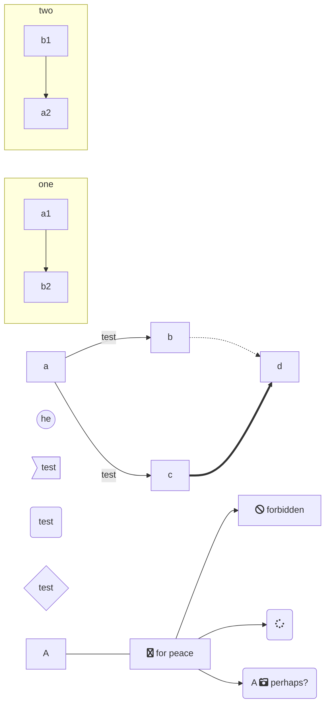
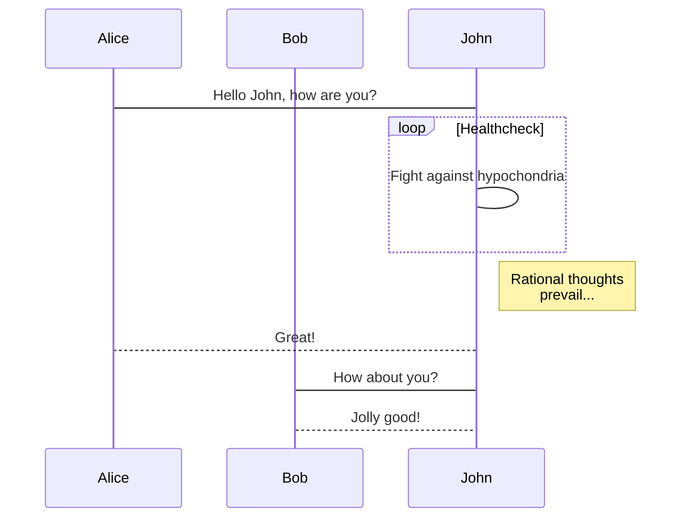
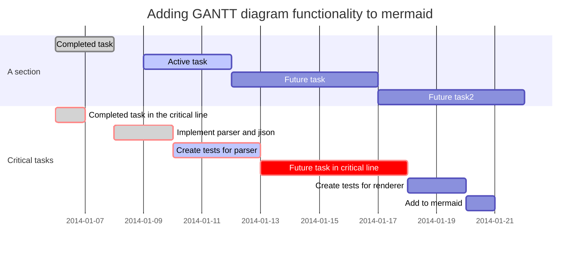
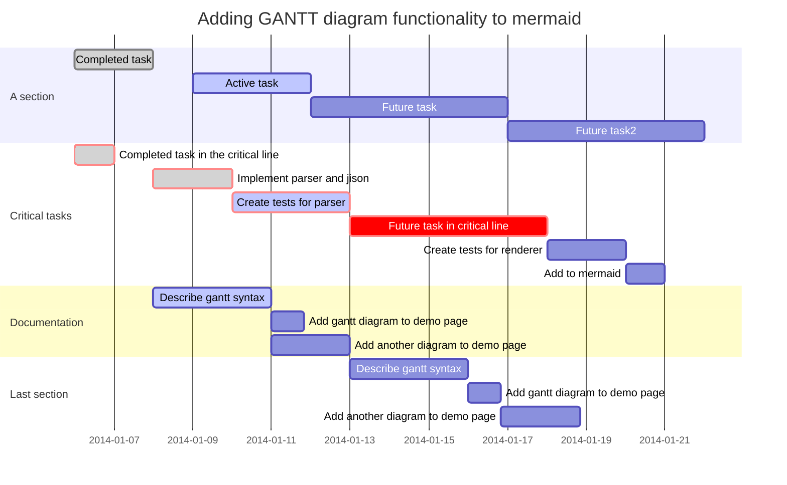
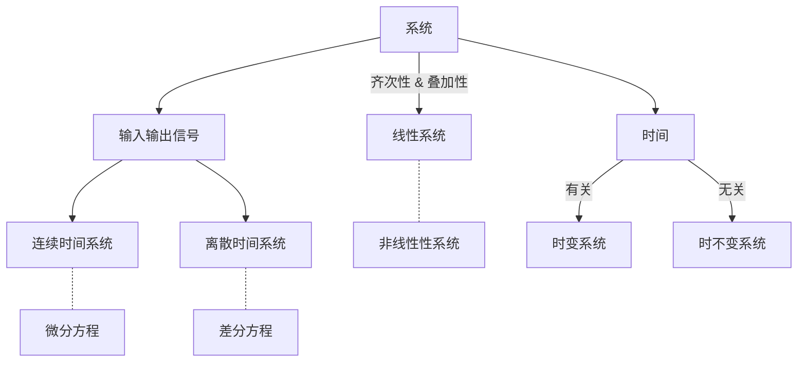

<h1 align="center">DSP</h1>

### DSP --> Digital Signal Process

- [x] completed
- [ ] incomplete


<i@typora.io>

:smile:













```mermaid
gantt
dateFormat  YYYY-MM-DD
title Shop项目交付计划

section 里程碑1 
数据库设计          :active,    p1, 2018-012-15, 3d
详细设计            :           p2, after p1, 2d

section 里程碑2
后端开发            :           p3, 2018-12-22, 20d
前端开发            :           p4, 2018-12-22, 15d

section 里程碑3
功能测试            :       p6, after p3, 5d
上线               :       p7, after p6, 2d
交付               :       p8, afterp7, 2d
```




