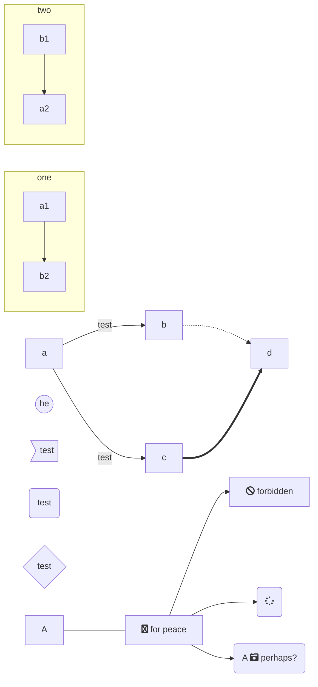
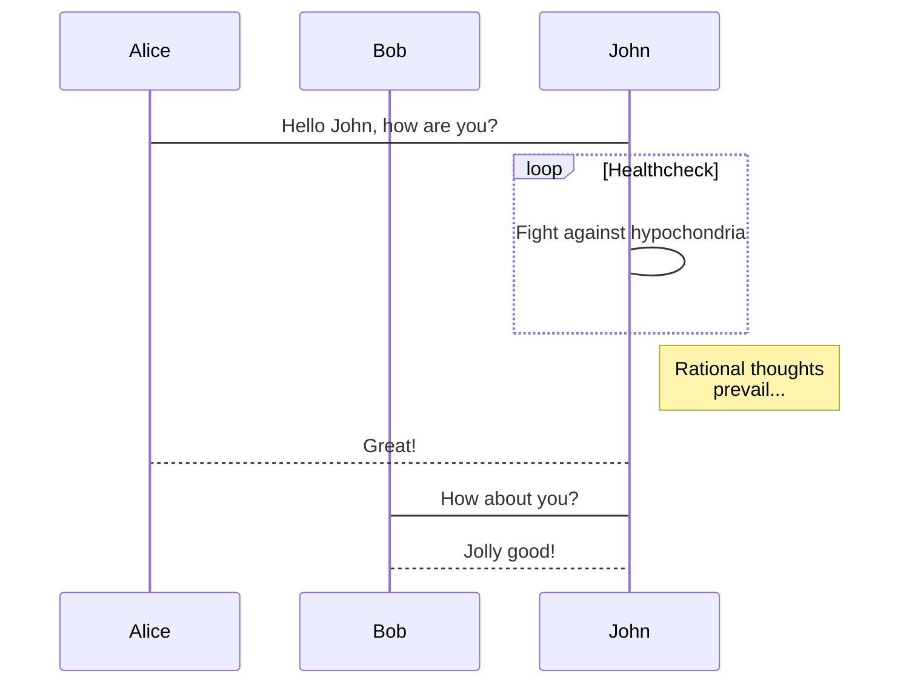
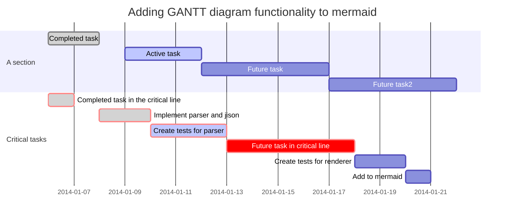
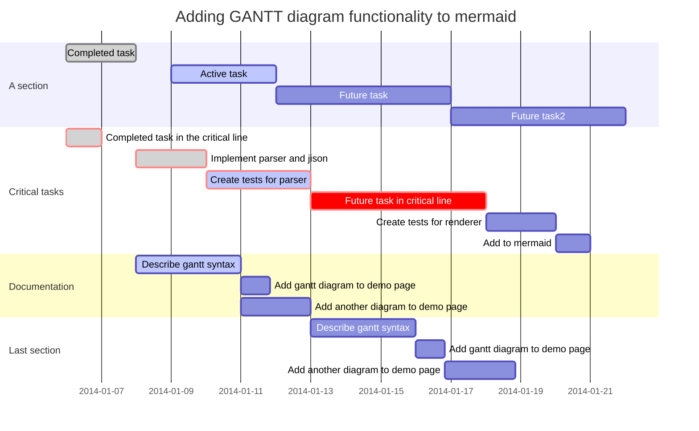
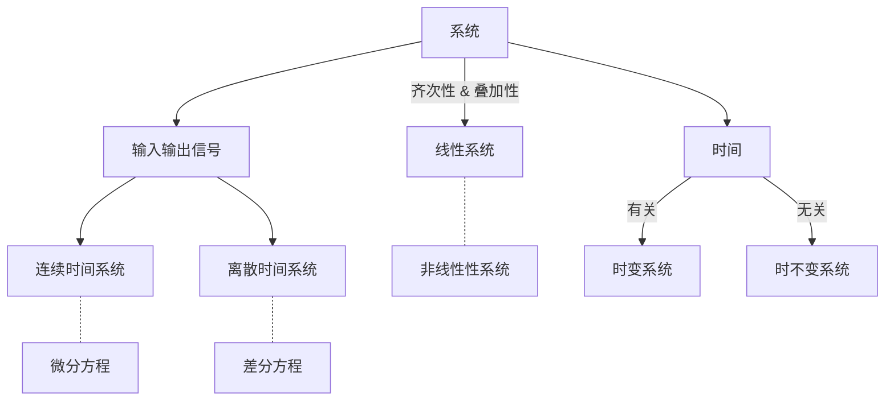

<h1 align="center">数字信号处理复习</h1>

# $\Re$ 目录

[TOC]

# $\wp$ 填空(10)

## 1.信号分类

- 连续时间信号

- 离散时间信号

- 模拟信号

- 数字信号

- 偶信号

  - $x(-t)=x(t),\forall\  t$

- 奇信号

  - $x(-t)=-x(t),\forall\  t$

- 周期信号

  - $x(t)=x(t+T)\quad\forall\ t$

- 非周期信号

- 确定信号

- 随机信号

- 实信号

  - $x(t)=\sum\limits_{i}A_ie^{s_it}$

- 复信号

- 能量信号
  $$
  E=\int\limits_{-\infty}^{\infty}|x(t)|^2dt
  $$

- 功率信号


$$
平均功率 \int\limits_{i}^{\infty}xdx=P=\lim\limits_{t_0\to\infty}\cfrac{1}{t_0}\int\limits_{-\frac{t_0}{2}}^{\frac{t_0}{2}}|x(t)|^2dt
$$


## 2.

# $\Re$ 选择(40)

# $\mho$ 简答(30)

# $\aleph$ 计算(20)


- [x] completed
- [ ] incomplete


<i@typora.io>

:smile:













```mermaid
gantt
dateFormat  YYYY-MM-DD
title Shop项目交付计划

section 里程碑1 
数据库设计          :active,    p1, 2018-012-15, 3d
详细设计            :           p2, after p1, 2d

section 里程碑2
后端开发            :           p3, 2018-12-22, 20d
前端开发            :           p4, 2018-12-22, 15d

section 里程碑3
功能测试            :       p6, after p3, 5d
上线               :       p7, after p6, 2d
交付               :       p8, afterp7, 2d
```




