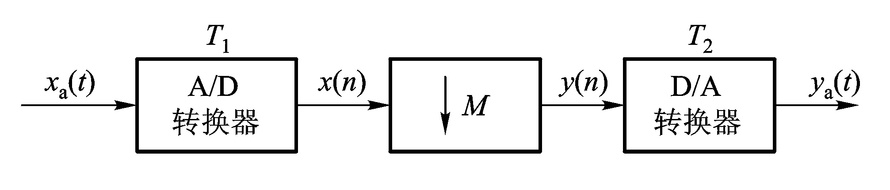

<h1 align="center">数字信号处理MOOC</h1>

## 第一单元测验

### 1.下面有关数字信号的概念，哪个说法是正确的？

- A.数字信号是时间变量是连续值，幅度值是离散值。

- `B.数字信号是时间变量是离散值，幅度值也是离散值。`
- C.数字信号是时间变量是离散值，幅度值是连续值。
- D.数字信号是时间变量是连续值，幅度值也是连续值。

### 2.1024点的DFT需要多少次的复数乘法运算？

- A.十万次

- B.千万次
- C.一万次
- `D.百万次`

### 3.哪一年,宾夕法尼亚大学发明了第一代电子管计算机？

- `A.1946年`
- B.1980年
- C.1956年
- D.1936年

### 4.CD唱盘是哪一年问世的？

- A.1990年

- B.1960年

- C.1978年

- `D.1982年`

### 5.由多个信号源产生的信号称为什么信号？

- A.离散信号
- `B.向量信号`
- C.标量信号
- D.连续信号

### 6. 数字信号处理的应用表现在哪几个方面？

### 7. 数字信号处理的发展表现在哪几个方面？

### 8. 数字信号处理与传统的模拟信号处理相比较,

### 除了数字系统共同优点,如抗干扰、可靠性强、便于大规模集成外,

### 还具有哪些明显的优点？

## 第二单元测验

###  9. 请确定以下序列的周期长度:$x(n)=\sin(\cfrac{\pi n}{4})-\cos(\cfrac{\pi n}{7})$

- A.4
- `B.56`
- C.28
- D.7

### 10.系统$y(n)=x^2(n)$,$y(n)$表示输出，$x(n)$表示输入,

### 试确定系统是否是线性系统？是否是时不变系统?

- A.非线性时变系统
- `B.非线性时不变系统`
- C.线性时不变系统
- D.线性时变系统

### 11.系统$y(n)=\sum\limits_{m=-{\infty}}^{n}x(m)$,其中$y(n)$表示输出，$x(n)$表示输入,

### 试确定系统是否是线性系统？是否是时不变系统？

- `A.线性时不变系统`

- B.线性时变系统
- C.非线性时变系统
- D.非线性时不变系统

### 12. 系统$y(n)=x(n-n_0)$,其中$n_0<0$,$y(n)$表示输出,$x(n)$表示输入。

### 试确定系统的因果性和稳定性。

- A.非因果不稳定系统
- B.因果不稳定系统
- C.因果稳定系统
- `D.非因果稳定系统`

### 13.系统$y(n)=g(n)x(n)$,其中$g(n)$有界,$y(n)$表示输出,$x(n)$表示输入。

### 试确定系统的因果性和稳定性。

- `A.因果稳定系统`
- B.非因果稳定系统
- C.因果不稳定系统
- D.非因果不稳定系统

### 14.令$X(e^{j\omega})$表示实因果序列$x(n)$的DTFT,求$x^*(n)$的DTFT:

- A.$X(e^{-j\omega})$
- `B.`$\large X^*(e^{-j\omega})$  
- C.$X^*(e^{j\omega})$
- D.$X(e^{j\omega})$

### 15.令$X(e^{j\omega})$表示实因果序列$x(n)$的DTFT,求$x(2n)$的DTFT:

- A.$0.5*[X(e^{j\omega/2})-X(-e^{-j\omega/2})]$
- `B.`$\large 0.5*[X(e^{j\omega/2})+X(-e^{j\omega/2})]$
- C.$0.5*[X(e^{j\omega/2})+X(-e^{-j\omega/2})]$
- D.$0.5*[X(e^{j\omega/2})-X(-e^{j\omega/2})]$

### 16.求序列$\delta(n-1)$的Z变换的收敛域:

- A.$0\le|z|\le\infty$
- B.$0\le|z|<\infty$
- `C.`$\large 0<|z|\le\infty$
- D.$0<|z|<\infty$

### 17.求以下序列的Z变换的收敛域:$a^{|n|},|a|<1$

- `A.`$\large |a|<|z|<\cfrac{1}{|a|}$
- B.$|a|<|z|<\infty$
- C.$0<|z|<\cfrac{1}{|a|}$
- D.$\cfrac{1}{|a|}<|z|<\infty$

### 18.一个线性时不变系统具有频率响应$H(e^{j\omega})=\cfrac{e^{j\omega}}{1.1+\cos\omega}$,

### 求系统的差分方程.

- `A.`$\large y(n)+2.2y(n-1)+y(n-2)=2x(n)$
- B.$y(n)+y(n-1)+y(n-2)=x(n)$
- C.$y(n)+1.1y(n-1)+y(n-2)=2x(n)$
- D.$y(n)+2.2y(n-1)+y(n-2)=x(n)$

### 19.试求下列序列的DTFT:

#### (1) $x(n)=\cfrac{1}{2}\delta(n+1)+\delta(n)+\cfrac{1}{2}\delta(n-1)$

#### (2) $x(n)=(\cfrac{1}{2})^nu(n+1)$

### 20. 请问正弦序列$\sin(\cfrac{16}{5}\pi n)$是否是周期序列?

### 若是,其周期长度是多少?

### 21. 试确定以下系统是否为线性系统？是否为时不变系统？

#### (1) $y(n)=x(n-n_0)$

#### (2) $y(n)=nx(n)$

#### (3) $y(n)=6x(n)+3$

#### (4) $y(n)=x^3(n)$

#### (5) $y(n)=\sum\limits_{m=-\infty}^nx(m)$

### 22.试确定以下系统的因果性和稳定性：

#### (1) $y(n)=\sum\limits_{k=n_0}^nx(k),n>n_0$

#### (2) $h(n)=\cfrac{1}{n!}u(n)$

#### (3) $h(n)=2^nR_N(n)$

#### (4) $h(n)=2^nu(n)$

#### (5) $h(n)=5^nu(-n)$

### 23. 求以下序列的*Z*变换及收敛域:

#### (1) $\delta(n-n_0)$

#### (2) $0.5^n[u(n)-u(n-10)]$

### 24. 设序列$x(n)$和$y(n)$的Z变换分别为$X(z)$和$Y(z)$,

### 试求$X(z)$和$Y(z)$的关系:

$\large\left\{
\begin{aligned}
y(2n)=x(n) \\
y(2n+1)=0 \\
\end{aligned}
\right.$

### 25. 设序列$x(n)$和$y(n)$的Z变换分别为$X(z)$和$Y(z)$,

### 试求$X(z)$和$Y(z)$的关系:

$\large y(2n)=y(2n+1)=x(n)$

### 26. 已知系统的差分方程$y(n)-0.25y(n-1)=0.5x(n)+0.45x(n-1)+0.35x(n-2)$,

### 且在$n<0$时$y(n)=0$.求该系统的系统函数。

### 27. $x(n)$的DTFT为$X(e^{j\omega})$,试求$x(-n)$的DTFT。

### 28. 讨论一个具有下列系统函数的线性时不变因果系统:

### $H(z)=\cfrac{1-a^{-1}z^{-1}}{1-az^{-1}}$

### 其中*a*为实数。

#### (1) 对于什么样的*a*值范围系统是稳定的？

#### (2) 证明该系统是一个全通系统，即频率响应的幅度为一常数。

### 29. 给定一连续带限信号$x_a(t)$,其频谱当$|f|>B$时，$X_a(t)=0$。求$x_a^2(t)$的最低采样频率。

- A.B
- B.2B
- `C.4B`
- D.8B

### 30. 给定一连续带限信号$x_a(t)$,其频谱当$|f|>B$时，$X_a(t)=0$。求$x_a(2t)$的最低采样频率。

- A.B
- B.2B
- `C.4B`
- D.8B

### 31. 给定一连续带限信号$x_a(t)$,其频谱当$|f|>B$时，$X_a(t)=0$。求$x_a(t)\cos(7\pi Bt)$的最低采样频率。

- A.B
- B.2B
- C.9B
- `D.4.5B`

### 32. 一带通模拟信号如图所示，现用以下采样频率对其采样.

### (1)10Hz    (2)25Hz   (3)50Hz   (4)100Hz,

### 求采样后哪几种采样频率存在混叠？

- `A.(1)`
- `B.(2)`
- C.(3)
- D.(4)

### 33. 已知信号x(t)为带限信号，最高截止频率300Hz，当采样频率为500Hz时，采样信号频谱不会产生混叠。

- A. $\surd$

- `B. ` $

### 34. 离散时间信号$x(n)$频谱如图所示，试求$M=3$直接抽取（不滤波）后的信号的频谱。

### 35. 数字录音带（DAT）驱动器的采样频率为48kHz，而激光唱盘（CD）播放机则以44.1kHz的采样频率工作。为了直接把声音从CD录制到DAT，需要把采样频率从44.1kHz转换到48kHz。为此，考虑完成图所示的采样率转换系统。求L和M的最小可能值以及适当的滤波器$H(e^{j\omega})$完成这个转换。

### 36. 序列$x(n)$的傅里叶变换如图所示，希望最大可能地对$x(n)$降低采样率，而不引入混叠。

### 37. 考虑图所示的系统，假设$x_a(t)$输入是带限的,

### 即对于$|\Omega|>4000\pi rad/s,X_a(j\Omega)\equiv0$。

#### (1) 为使$y_a(t)$等于$x_a(t)$,应该对$M,T_1,T_2$有何约束?

#### (2) 如果$f_1=1/T_1=30kHz,M$最大可以取多少?